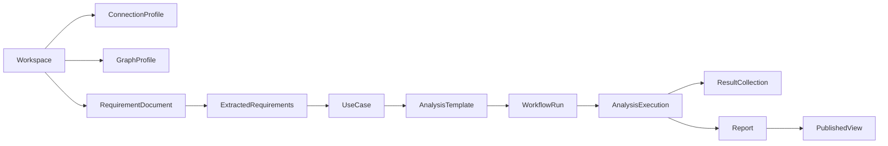

# Agentic Graph Analytics UI Vision

**Status:** Draft  
**Audience:** Product, engineering, solutions architecture, field teams  
**Purpose:** Reframe `agentic-graph-analytics` from a reusable Python library into a product experience for configuring, running, reviewing, and sharing graph analytics across customer databases.

---

## Executive Summary

`agentic-graph-analytics` already contains most of the platform primitives needed for a product: ArangoDB connection helpers, GAE orchestration, schema analysis, requirements extraction, use-case generation, template generation, execution tracking, lineage, report generation, MCP tools, and an Analysis Catalog persisted in ArangoDB. The missing layer is a UI and product data model that lets teams use those capabilities without creating a new wrapper repository for each customer.

Today, customer work tends to live in separate repos organized around verticals such as AdTech identity graphs, clinical trials/CRO networks, and open source intelligence graphs. Those repos bundle customer documents, connection settings, graph names, collection roles, analysis templates, workflow scripts, output folders, and reports. This is effective for bespoke delivery, but it does not scale as a repeatable product. The proposed UI turns those repo-level conventions into product objects:

- Customer workspaces
- Connection profiles
- Graph profiles
- Requirements document libraries
- Requirements copilot sessions
- Use-case catalogs
- Analysis templates
- Workflow runs
- Dynamic interactive reports
- Audit and lineage records

The strongest product direction is to store customer-specific product metadata in the customer's ArangoDB database, adjacent to the graph being analyzed, while keeping secrets out of the graph database. This extends the existing Analysis Catalog pattern and lets the UI render requirements, reports, runs, and lineage dynamically from database-resident records. File-based import/export should remain available for migration, audit, and offline collaboration, but the system of record for product state should become ArangoDB collections owned by the platform.

---

## Current Operating Model

The current pattern treats `agentic-graph-analytics` as a library and creates a separate project for each customer or dataset. Each wrapper project adds domain context and operational glue:

- **AdTech identity graph projects** use business requirement markdown files, YAML configuration, agentic workflow scripts, vertical-specific reporting settings, token handling, and exported Markdown/HTML reports under `outputs/`.
- **Clinical trials/CRO projects** use Python analysis templates, `.env` connection helpers, guide documents, migration notes, analysis markdown files, and GAE result collections.
- **Open source intelligence projects** use Python templates, use-case markdown, explicit graph definitions, algorithm settings, and result collection naming conventions.

Across these projects, the repeatable shape is clear:

1. Define what business problem the graph should answer.
2. Connect to a customer ArangoDB cluster and database.
3. Discover or describe the graph schema.
4. Select graph collections and collection roles.
5. Generate or define use cases.
6. Convert use cases into GAE templates.
7. Execute analyses.
8. Store result collections in the customer database.
9. Generate narrative and interactive reports.
10. Preserve enough state to rerun, explain, and compare results.

The UI should make this lifecycle explicit and durable instead of leaving it spread across repositories and scripts.

---

## Product Vision

Agentic Graph Analytics should become the operating console for graph intelligence on ArangoDB. A user should be able to connect a customer database, upload or author business requirements, let agents propose graph analytics, review and approve generated templates, execute against GAE, and publish interactive reports without creating a new repository.

The product should feel like a graph analytics workspace, not a code generator. Code remains available for advanced users, but the default experience should be:

- **Create a workspace:** Identify a customer, project, environment, and database.
- **Connect securely:** Add a connection profile and verify permissions.
- **Map the graph:** Inspect named graphs, collections, edge definitions, counts, and roles.
- **Load requirements:** Upload documents or write requirements directly in the UI.
- **Generate use cases:** Turn requirements and schema into proposed analyses.
- **Curate templates:** Review algorithm choice, parameters, result fields, estimated cost, and collection selection.
- **Run workflows:** Execute traditional, agentic, or parallel agentic workflows with progress and checkpoints.
- **Review results:** Inspect generated insights, charts, recommendations, lineage, and raw result samples.
- **Publish reports:** Share dynamic report views backed by database records, not static local files.
- **Iterate:** Version requirements, rerun analyses, compare epochs, and preserve audit history.

---

## Design Principles

### 1. Customer State Belongs With the Customer Graph

The UI should store project metadata in the target customer's ArangoDB database where possible. The customer database already contains the graph, GAE result collections, and the existing Analysis Catalog can already persist execution lineage there. Co-locating requirements, templates, report manifests, and run metadata enables portable workspaces and point-in-time reproducibility.

This does not mean storing credentials in customer graph collections. Secrets should live in environment variables, a local encrypted keyring, a cloud secrets manager, or an ArangoDB-managed integration depending on deployment mode. The customer database can store references to secret profiles, not the secret values themselves.

### 2. Product Objects Should Replace Wrapper Repos

Each artifact currently stored in a customer repo should have a product equivalent:

| Wrapper repo artifact | Product object |
| --- | --- |
| `.env` files | Connection profile plus secret reference |
| `business_requirements.md` / PDFs | Requirement document and extracted requirement version |
| YAML config | Workspace, graph profile, collection roles, reporting profile |
| Python `analysis_templates.py` | Analysis template catalog |
| Workflow script | Run configuration and workflow launch request |
| `outputs/workflow_state.json` | Workflow run state and checkpoints |
| Exported Markdown/HTML reports | Report manifests, sections, chart specs, and rendered views |
| Result collections | Execution output collections linked from catalog records |

The migration goal is not to eliminate files. It is to make files import/export formats rather than the primary product database.

### 3. The UI Should Keep Humans in the Loop

Agentic automation is valuable, but customer-facing analytics needs review points. The UI should expose approval gates for:

- Schema interpretation
- Collection role assignment
- Requirements extraction
- Use-case prioritization
- Algorithm and parameter selection
- Estimated GAE cost/time
- Report publication

The product should let agents propose and explain, while users approve, edit, rerun, and compare.

### 4. Reports Should Be Dynamic, Not Static Exports

The existing HTML report generation is useful, but static files recreate the wrapper-repo problem. A product UI should store reports as structured data and render them dynamically:

- Report metadata and status
- Sections and narrative text
- Insight and recommendation records
- Chart specifications
- Query/result references
- Supporting evidence and lineage links
- Rendered snapshots for export

HTML, Markdown, and PDF should become export targets generated from stored report records. The default user experience should be a report browser in the UI that can fetch current report data from ArangoDB and re-render it.

### 5. The Catalog Becomes the Product Backbone

The Analysis Catalog already tracks requirements, use cases, templates, executions, epochs, and lineage. The UI should extend rather than bypass it. New product collections should either extend catalog entities or sit beside them with stable foreign keys.

The result should be one lineage graph from uploaded requirements to published reports:

---

## Proposed User Experience

### Workspace Home

The landing page should show all customer workspaces the user can access. Each workspace represents a customer project plus environment, such as `AdTech Identity Graph - Production` or `Open Source Intelligence Graph - Sandbox`.

The workspace home should show:

- Connection health
- Target cluster and database
- Named graph inventory
- Recent runs
- Latest published reports
- Open approval tasks
- Cost and duration summary
- Catalog completeness warnings

### Connection and Environment Setup

The first-run flow should replace hand-edited `.env` files with a guided setup:

1. Select deployment mode: self-managed ArangoDB, ArangoGraph, AMP/GAE-enabled, or local development.
2. Enter endpoint, database, username, SSL options, and GAE mode.
3. Configure secret references for passwords, API keys, OASIS tokens, or provider tokens.
4. Test database access.
5. Test graph inventory access.
6. Test GAE capability and permissions.
7. Save a connection profile.

Connection profiles should be environment-scoped. A customer may have development, staging, and production databases with different credentials but the same workspace taxonomy.

### Graph Explorer

The graph explorer should help users understand the graph before running agents. It should support:

- Named graph discovery
- Vertex and edge collection inventory
- Counts and sample documents
- Edge definition visualization
- Core/satellite/result collection tagging
- Algorithm compatibility warnings
- Schema snapshots
- Graph profile versioning

The AdTech YAML concept of `core_collections` and `satellite_collections` should become editable collection roles. The UI should explain why roles matter, for example why WCC should exclude reference or result collections but PageRank may use a broader graph.

### Requirements Studio

The requirements studio should support both document upload and direct authoring. Users should be able to:

- Upload Markdown, PDF, DOCX, and plain text.
- Paste requirements from customer workshops.
- Assign domain, customer, tags, and confidentiality labels.
- Extract structured requirements using the existing document pipeline.
- Review extracted objectives, constraints, and success criteria.
- Version changes.
- Compare requirement versions.
- Link requirements to generated use cases.

Requirements should be immutable once used in a published run. Editing should create a new version so lineage remains stable.

### Requirements Copilot

Requirements Studio should include a built-in Requirements Copilot that helps users create a business requirements document when one does not already exist or when an uploaded document is incomplete. The copilot should use the connected graph schema as grounding context, then interview the user about domain, business objectives, target decisions, and desired analytics outcomes.

The copilot should not treat schema discovery as a substitute for business intent. It should distinguish between what was observed in the graph and what the user confirmed. The resulting draft should be editable and must be approved as a requirement version before it can drive use-case generation.

The copilot should support:

- Schema-aware prompts based on named graphs, collections, edge definitions, counts, sample fields, and collection roles.
- Domain selection and refinement for verticals such as AdTech, clinical trials/CRO, and open source intelligence.
- Guided use-case discovery across graph analytics patterns such as influence ranking, community detection, anomaly detection, pathfinding, segmentation, propagation, and risk analysis.
- Constraint capture for runtime, cost, refresh cadence, data sensitivity, reporting audience, and required evidence.
- Draft BRD generation with domain description, business objectives, analytics questions, success criteria, assumptions, constraints, and candidate GAE use cases.
- Provenance labels for each statement: observed from schema, inferred from schema, user-provided, or assumption requiring confirmation.
- Human review, editing, and approval before downstream use-case and template generation.

### Use-Case Catalog

The use-case catalog is where business intent becomes graph analytics intent. It should show generated and hand-authored use cases with:

- Business title and description
- Mapped objectives and requirements
- Recommended algorithm
- Required graph shape
- Collection selection
- Estimated cost and runtime
- Expected result fields
- Priority
- Status: proposed, approved, rejected, deprecated
- Rationale and agent confidence

Users should be able to import existing clinical trials/CRO and open source intelligence Python templates, along with AdTech YAML use cases, into this catalog.

### Template Workbench

The template workbench is the human approval surface before execution. It should expose the execution-level details currently hidden in Python dictionaries:

- Graph name or explicit edge definitions
- Algorithm and parameters
- Result collection name
- Result attributes
- Engine size and GAE deployment mode
- Wait/retry policy
- Estimated time and cost
- Collection filters
- Validation status

The UI should validate templates before execution and show blocking issues such as missing graph names, unsupported algorithms, missing result fields, or unavailable collections.

### Workflow Runner

The workflow runner should provide a live operational view of each run:

- Selected workflow mode: traditional, agentic, or parallel agentic
- Input documents and requirement version
- Generated use cases and templates
- Execution progress by step
- GAE job IDs and statuses
- Checkpoints and resume actions
- Agent decisions and warnings
- Cost and duration
- Failure recovery actions

This can initially poll the existing workflow and catalog APIs. Later releases can add server-sent events or websockets.

### Agentic Workflow Visualizer

The workflow runner should include a visual agentic workflow DAG for run-level explainability. This should be comparable in purpose to an agent pipeline monitor: it helps users understand what is running, what each agent or workflow step produced, why the system made a decision, and where failures occurred.

The MVP visualizer should be operational rather than a general graph editing canvas. It should show:

- Workflow stages as nodes: schema analysis, requirements extraction, use-case generation, template generation, GAE execution, catalog persistence, and report generation.
- Directed dependencies between stages, including parallel branches for parallel agentic mode.
- Live status per node: pending, running, completed, failed, skipped, or paused.
- Step metadata: agent name, start/end time, duration, cost estimate, warnings, retry count, and checkpoint ID.
- Inputs and outputs per step, linked to product artifacts such as requirement versions, use cases, templates, executions, result collections, and reports.
- Failure context and recovery actions such as retry, resume, cancel, or open logs.

The visualizer should not replace the graph explorer or report lineage explorer. It is the operational view of a workflow run, while the graph explorer explains the customer graph and the lineage explorer explains durable relationships among artifacts.

### Report Browser

The report browser should render reports from structured records stored in ArangoDB. A report should not require a local `outputs/` folder to be useful.

Report views should include:

- Executive summary
- Key metrics
- Interactive charts
- Insights with confidence and evidence
- Recommendations with effort/impact
- Source requirements
- Use case and template lineage
- Execution metadata
- Raw result samples
- Export buttons for HTML, Markdown, JSON, and PDF

Reports should support a "published" state. Draft reports can be edited or regenerated; published reports should be immutable snapshots with exportable artifacts.

### Catalog and Lineage Explorer

The catalog explorer should make the Analysis Catalog visible:

- Epoch list
- Execution search
- Lineage graph
- Requirement-to-report traceability
- Result collection links
- Algorithm performance comparison
- Run history across environments
- Audit log

This turns the current catalog from a backend feature into a primary trust surface.

---

## Storage Strategy

### Recommended Default

Use the customer ArangoDB database as the system of record for non-secret product state. Create product-owned collections with a reserved prefix such as `aga_` or continue the existing `analysis_` prefix for catalog-native objects. The exact prefix should be consistent and documented.

The database-resident model should include:

- Workspace metadata
- Graph profiles
- Collection roles
- Requirement documents and versions
- Extracted requirements
- Use cases
- Templates
- Workflow runs
- Report manifests
- Report sections
- Chart specifications
- Published report snapshots
- Audit events

Binary source documents can be handled in one of three ways:

1. Store extracted text and metadata in ArangoDB, plus a URI to external object storage.
2. Store small original documents as base64 blobs in ArangoDB with size limits.
3. Store only normalized extracted content in ArangoDB and rely on export bundles for original files.

The preferred product default is option 1 for production and option 2 only for local demos or small documents.

### Why Store Product State in the Customer Database?

Benefits:

- Keeps graph, results, requirements, reports, and lineage together.
- Makes workspaces portable across UI deployments.
- Supports dynamic report rendering without filesystem access.
- Allows AQL queries across product metadata and graph analytics outputs.
- Builds on the existing Analysis Catalog storage backend.
- Avoids a separate operational database for early product releases.

Trade-offs:

- Requires write permissions in the customer database.
- Product metadata collections must not collide with customer collections.
- Large documents and rendered report snapshots need retention policies.
- Multi-customer SaaS mode may eventually need a control-plane database.

### Secrets Policy

Do not store secret values in customer graph collections. Product records may store:

- Secret reference IDs
- Provider names
- Last verification time
- Expiration metadata
- Non-sensitive connection descriptors

Secret values should be resolved by the server runtime through environment variables, local encrypted storage, an enterprise secret manager, or deployment-specific credentials.

### Proposed Product Collections

The following collections extend the existing catalog model:

- `aga_workspaces`: customer/project/environment metadata.
- `aga_connection_profiles`: non-secret connection descriptors and secret references.
- `aga_graph_profiles`: named graph, collection inventory, schema snapshot, graph role metadata.
- `aga_collection_roles`: core, satellite, reference, result, excluded, and custom role assignments.
- `aga_documents`: source document metadata, extracted text references, hashes, and storage URIs.
- `aga_requirement_interviews`: Requirements Copilot sessions, prompts, answers, assumptions, and provenance.
- `aga_requirement_versions`: normalized requirements linked to source documents.
- `aga_report_manifests`: report identity, status, version, run linkage, and publication metadata.
- `aga_report_sections`: ordered report content blocks.
- `aga_chart_specs`: chart definitions that can be rendered by the UI.
- `aga_published_snapshots`: immutable published report snapshots and export metadata.
- `aga_audit_events`: user and system actions.

Existing catalog collections should remain:

- `analysis_epochs`
- `analysis_requirements`
- `analysis_use_cases`
- `analysis_templates`
- `analysis_executions`
- `analysis_lineage_edges`
- `analysis_epoch_edges`

Where possible, product collections should reference catalog records rather than duplicate them.

---

## Product Architecture

### Frontend

A React or Next.js frontend should provide the product UI. The frontend should not connect directly to customer databases. It should call a backend API that handles authentication, authorization, secret resolution, and database operations.

Major frontend modules:

- Workspace dashboard
- Connection setup wizard
- Graph explorer
- Requirements studio
- Requirements copilot
- Use-case catalog
- Template workbench
- Workflow runner
- Agentic workflow visualizer
- Report browser
- Catalog/lineage explorer
- Settings and administration

### Backend API

The backend should wrap existing Python capabilities. A FastAPI service is the natural fit because the repo is already Python-based and contains the orchestration logic.

Backend responsibilities:

- Workspace CRUD
- Connection testing
- Graph inventory and schema snapshot APIs
- Requirements upload/extraction APIs
- Requirements Copilot interview and draft-generation APIs
- Use-case and template generation APIs
- Workflow launch/status/resume APIs
- Workflow step event and DAG status APIs
- Report query/render/export APIs
- Catalog query APIs
- Secret reference resolution
- Authorization and audit logging

The existing MCP tools should remain useful for agent clients, but a browser UI should have explicit HTTP APIs. MCP can be a companion integration surface, not the only backend boundary.

### Execution Model

Long-running workflows should run out of request path. The backend should enqueue jobs and persist status. Early releases can use an in-process worker for local/single-user deployments; production should use a queue or durable task runner.

Run state should be persisted incrementally so the UI can survive reloads and backend restarts.

### Deployment Shapes

The product should support three deployment shapes:

1. **Local desktop/dev mode:** UI and backend run locally, connect to customer database using local credentials.
2. **Customer-hosted mode:** UI/backend deployed inside customer or field environment, with customer-controlled secrets.
3. **Managed control-plane mode:** Future SaaS-like deployment with a control-plane database and customer database connectors.

The first implementation should target local/dev and customer-hosted modes. This is closest to the current repo-based workflow while removing per-customer repository creation.

---

## Migration From Existing Customer Repos

The UI should include importers so existing work is not stranded.

### AdTech Import

Inputs:

- `docs/business_requirements.md`
- optional PDF requirements
- vertical configuration YAML
- generated report folders
- workflow state JSON

Mapped product objects:

- Workspace: AdTech identity graph analytics
- Graph profile: customer identity graph
- Collection roles: core/satellite lists from YAML
- Requirements document/version: business requirements markdown
- Use cases: YAML `use_cases`
- Reporting profile: AdTech, chart-enabled, LLM settings
- Historical runs/reports: imported as snapshots where possible

### Clinical Trials/CRO Import

Inputs:

- `scripts/analysis_templates.py`
- `analyses/*.md`
- `docs/guides/*`
- connection conventions from `.env.example`

Mapped product objects:

- Workspace: clinical trials/CRO graph analytics
- Template catalog: Python template dictionaries
- Use cases: template `use_case` fields and guide documents
- Result collection references: template result collections
- Report snapshots: markdown analyses

### Open Source Intelligence Import

Inputs:

- open source intelligence use-case documents
- `scripts/analysis_templates.py`
- per-use-case scripts under `analyses/`

Mapped product objects:

- Workspace: open source intelligence graph analytics
- Use-case catalog: influence ranking, cohesion, intermediaries, predictive categorization
- Template catalog: graph definitions, algorithms, result storage configs
- Report snapshots: existing analysis outputs where available

---

## Phased Product Roadmap

### Phase 0: Product Metadata Foundation

- Define product collections.
- Extend catalog models where appropriate.
- Add workspace and graph profile storage.
- Add import/export schema for documents, use cases, templates, and reports.
- Build CLI importers for AdTech, clinical trials/CRO, and open source intelligence patterns.

### Phase 1: Read-Only UI

- Workspace dashboard.
- Connection health display.
- Graph inventory browser.
- Catalog execution browser.
- Existing report listing and dynamic report rendering from stored records.

This phase proves that reports and metadata can be stored in the customer database and rendered without a wrapper repo.

### Phase 2: Requirements and Template UI

- Document upload and extraction.
- Requirement version review.
- Use-case generation and approval.
- Template workbench and validation.
- Collection role editor.

This phase replaces most custom repo configuration.

### Phase 3: Workflow Execution UI

- Launch traditional, agentic, and parallel workflows.
- Track progress and checkpoints.
- Show GAE job status.
- Support resume/retry.
- Persist workflow state.
- Generate dynamic reports.

This phase replaces customer-specific run scripts.

### Phase 4: Collaboration and Publishing

- User roles and permissions.
- Report publication workflow.
- Immutable report snapshots.
- Comments and approvals.
- Export packages.
- Audit views.

### Phase 5: Multi-Customer Productization

- Tenant/control-plane model.
- Enterprise secret manager integrations.
- Central workspace registry.
- Deployment automation.
- Usage and billing analytics if needed.

---

## Key Risks and Open Questions

### Risks

- **Scope creep:** A full product UI can become large quickly. Start with catalog/report visibility and importers.
- **Secrets handling:** The product must avoid storing credentials in graph collections.
- **Database permissions:** Some customers may not allow platform metadata collections in production graph databases.
- **Report rendering complexity:** Existing HTML exports may need refactoring into structured report records and chart specs.
- **Long-running workflow reliability:** Browser-triggered workflows need durable job state, retries, and cancellation.
- **Template import safety:** Python template importers should parse data safely rather than execute arbitrary customer code.

### Open Questions

- Should product collections use an `aga_` prefix or continue the `analysis_` naming scheme?
- What is the maximum source document size that can be stored directly in ArangoDB?
- Which deployment mode is the first supported target: local product console or customer-hosted web app?
- What authentication model is required for the UI in the first release?
- Should report editing be supported, or should reports only be regenerated from structured inputs?
- How much of the MCP tool surface should be reused behind the backend API?

---

## Recommendation

Build the UI as a product layer over the existing Python platform, backed by product metadata collections in the customer ArangoDB database. Start with a read-only workspace/report/catalog UI and importers for existing customer repos. Then add requirements management, template approval, and workflow execution. This path preserves the strengths of the current library while removing the operational need to create a bespoke repository for each customer.

